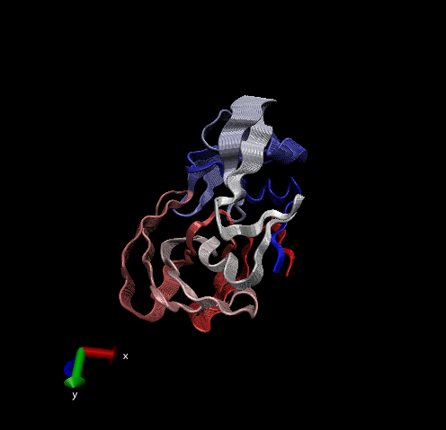

```{r setup, include=FALSE}
knitr::opts_chunk$set(echo = TRUE)
```

```{r}
library(bio3d)
pdb <- read.pdb("1hsg")
pdb 
```

```{r}
head(pdb$atom)
```

Let's do that quick bioinformatics prediction of protein dynamics (flexibility). We use the `nma()` function, which dose normal mode analysis

Function nma() provides normal mode analysis (NMA) on both single structures (if given a singe PDB input object) or the complete structure ensemble (if provided with a PDBS input object). This facilitates characterizing and comparing flexibility profiles of related protein structures.

```{r}
modes <- nma(pdb)
plot(modes)
```

Make a trajectory of this prediction with the `mktrj()`/

```{r}
mktrj(modes, file="nma.pdb")
```

And the iamge from VMD




# Comparative structure analysis of Adenylate Kinase

Start by getting a sequence of interest

```{r}
aa <- get.seq("1ake_A")
aa
```

I want to serach the PDB database (the main db for exp structures) for sequences like my aa sequence.

```{r}
# Blast or hmmer search 
blast <- blast.pdb(aa)
```

```{r}
# Plot a summary of search results
hits <- plot(blast)
hits
```

Now I have my top hits from the search of the PDB
```{r}
# List out some 'top hits'
hits$pdb.id
head(hits$pdb.id)
```

```{r}
hits <- NULL
hits$pdb.id <- c('1AKE_A','4X8M_A','6S36_A','6RZE_A','4X8H_A','3HPR_A','1E4V_A','5EJE_A','1E4Y_A','3X2S_A','6HAP_A','6HAM_A','4K46_A','4NP6_A','3GMT_A','4PZL_A')
```


```{r}
# Download related PDB files
files <- get.pdb(hits$pdb.id, path="pdbs", split=TRUE, gzip=TRUE)
```

#Align and superpose structures

Now we awant to allign all these structure. We will use the function `pdbaln`.


```{r}
# Align related PDBs
pdbs <- pdbaln(files, fit = TRUE)#, exefile="msa")
```

```{r}
pdbs
```


```{r}
# Vector containing PDB codes for figure axis
ids <- basename.pdb(pdbs$id)

# Draw schematic alignment
plot(pdbs, labels=ids)
```
Viewing our superposed structures
```{r}
library(bio3d.view)
library("rgl")
view.pdbs(pdbs)
```

Annotate collected PDB structures
```{r}
anno <- pdb.annotate(ids)
unique(anno$source)
```

#Principal component analysis

PCA can be performed on the structural ensemble (stored in the pdbs object) with the function pca.xyz(), or more simply pca().

```{r}
pdbs$xyz
```

Here we will do PCA on the xyz coordinate data of all these structures with `pca()` functon in bio3d

```{r}
# Perform PCA
pc.xray <- pca(pdbs)
plot(pc.xray)
```

Let's visualize the displacement (i.e. movement of the structure) that are capatured PC1.

```{r}
mktrjmktrj(pc.xray, pc=1, file="pca.pdb")
```


Function rmsd() will calculate all pairwise RMSD values of the structural ensemble. This facilitates clustering analysis based on the pairwise structural deviation:

```{r}
# Calculate RMSD
rd <- rmsd(pdbs)

# Structure-based clustering
hc.rd <- hclust(dist(rd))
grps.rd <- cutree(hc.rd, k=3)

plot(pc.xray, 1:2, col="grey50", bg=grps.rd, pch=21, cex=1)
```

```{r}
pc1 <- mktrj(pc.xray, pc=1, file="pca.pdb")
view.xyz(pc1)
```


```{r}
#Plotting results with ggplot2
library(ggplot2)
library(ggrepel)

df <- data.frame(PC1=pc.xray$z[,1], 
                 PC2=pc.xray$z[,2], 
                 col=as.factor(grps.rd),
                 ids=ids)

p <- ggplot(df) + 
  aes(PC1, PC2, col=col, label=ids) +
  geom_point(size=2) +
  geom_text_repel(max.overlaps = 20) +
  theme(legend.position = "none")
p
```

```{r}
# NMA of all structures
modes <- nma(pdbs)
plot(modes, pdbs, col=grps.rd)
```

